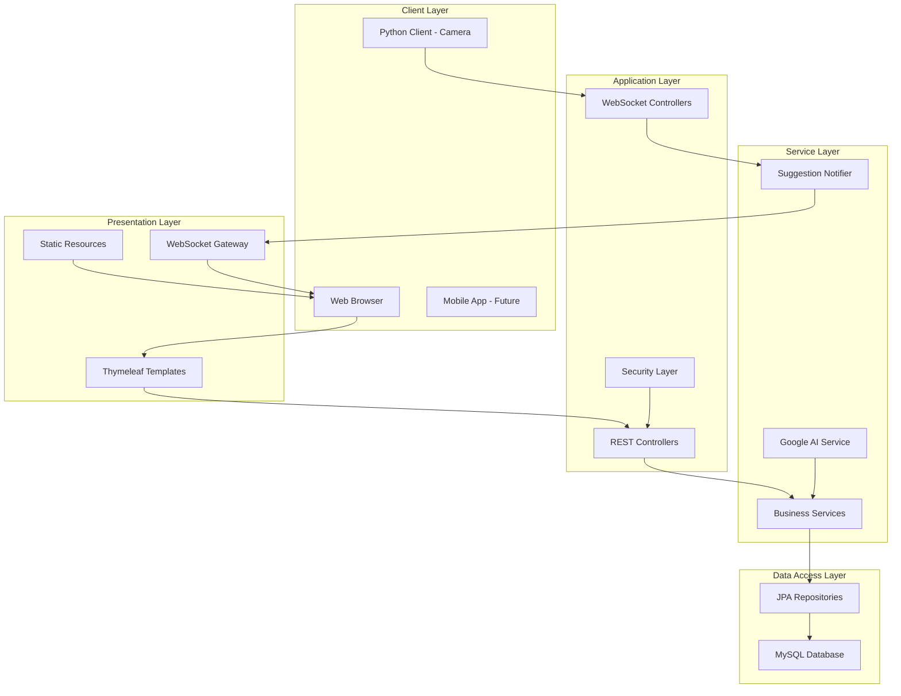
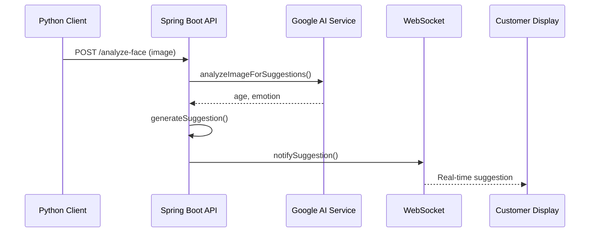
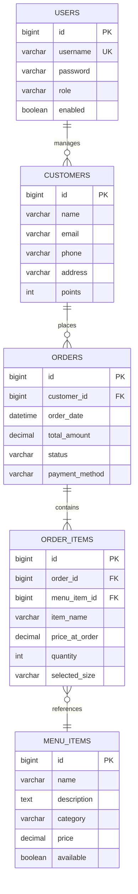

# Ứng Dụng Quản Lý Quán Cà Phê Thông Minh

## Giới Thiệu Dự Án

### Mục Tiêu
- Phát triển hệ thống quản lý quán cà phê toàn diện
- Tích hợp công nghệ AI để gợi ý đồ uống thông minh
- Cung cấp giao diện thân thiện cho nhân viên và khách hàng
- Tối ưu hóa trải nghiệm đặt hàng và thanh toán

### Công Nghệ Chính
- **Backend**: Java Spring Boot 3.2.5
- **Frontend**: HTML/CSS/JavaScript với Thymeleaf
- **Database**: MySQL 8.0
- **AI Integration**: Google AI Vision API
- **Realtime Communication**: WebSocket (STOMP)
- **Security**: Spring Security với JWT

---

## Kiến Trúc Hệ Thống

### Sơ Đồ Kiến Trúc Tổng Quan



---

## Các Module Chính

### 1. Quản Lý Menu
**Chức năng:**
- Thêm/sửa/xóa món ăn đồ uống
- Phân loại theo danh mục (Cà phê, Trà sữa, Topping, etc.)
- Hỗ trợ nhiều kích cỡ (S/M/L) với giá khác nhau
- Upload hình ảnh món ăn

**Model Quan Trọng:**
```java
@Entity
public class MenuItem {
    private String name;
    private String description;
    private String category;
    private Double priceS, price, priceL; // Giá theo size
    private boolean available;
}
```

### 2. Quản Lý Khách Hàng
**Chức năng:**
- Lưu trữ thông tin khách hàng
- Hệ thống điểm thưởng tích lũy
- Lịch sử đặt hàng

**Model:**
```java
@Entity
public class Customer {
    private String name;
    private String email;
    private String phone;
    private String address;
    private Integer points; // Điểm thưởng
}
```

### 3. Quản Lý Đơn Hàng
**Chức Năng:**
- Đặt hàng tại quầy hoặc giao tận nơi
- Theo dõi trạng thái đơn hàng
- Thanh toán tiền mặt hoặc chuyển khoản QR
- In hóa đơn

**Mô Hình Quan Hệ:**
```mermaid
classDiagram
    Order ||--o{ OrderItem : contains
    OrderItem }o--|| MenuItem : references
    Order }o--|| Customer : belongs to

    class Order {
        +Long id
        +String tableNumber
        +LocalDateTime orderDate
        +Double totalAmount
        +String status
    }

    class OrderItem {
        +String itemName
        +Double priceAtOrder
        +Integer quantity
        +String selectedSize
        +String notes
    }

    class MenuItem {
        +String name
        +Double price
        +String category
    }
```

### 4. AI Gợi Ý Thông Minh
**Chức Năng:**
- Phân tích khuôn mặt khách hàng bằng camera
- Ước tính độ tuổi và cảm xúc
- Gợi ý đồ uống phù hợp dựa trên:
  - Độ tuổi (trẻ em: trà sữa, thanh thiếu niên: nước ép, người lớn: cà phê)
  - Cảm xúc (vui vẻ: đồ uống sáng tạo, buồn: đồ uống ấm áp)

**Luồng Xử Lý:**


### 5. Hệ Thống Thanh Toán QR Code
**Chức Năng:**
- Tự động tạo mã QR VietQR
- Hỗ trợ chuyển khoản ngân hàng
- Theo dõi trạng thái thanh toán

**Tích Hợp:**
- Sử dụng API vietqr.io để tạo mã QR
- Tự động điền thông tin thanh toán
- Hiển thị real-time trên màn hình khách hàng

---

## Giao Diện Người Dùng

### 1. Giao Diện Admin
**Trang Quản Lý Menu:**
- Danh sách món ăn dạng bảng
- Form thêm/sửa món với upload ảnh
- Phân loại theo danh mục
- Cập nhật giá theo size

**Trang Quản Lý Khách Hàng:**
- Danh sách khách hàng với thông tin chi tiết
- Hệ thống điểm thưởng
- Lịch sử đơn hàng

**Trang Đặt Hàng:**
- Giao diện thân thiện cho nhân viên
- Tích hợp gợi ý AI
- Giỏ hàng real-time
- Tạo mã QR thanh toán

### 2. Giao Diện Khách Hàng
**Màn Hình Hiển Thị:**
- Hiển thị gợi ý đồ uống từ AI
- Danh sách món trong giỏ hàng
- Mã QR thanh toán
- Thông tin khuyến mãi

### 3. Giao Diện Mobile (Future)
- App đặt hàng di động
- Tích hợp camera AI
- Thanh toán online
- Theo dõi đơn hàng

---

## Công Nghệ Và Tích Hợp

### Backend Technologies
```xml
<!-- Spring Boot Stack -->
<dependency>
    <groupId>org.springframework.boot</groupId>
    <artifactId>spring-boot-starter-web</artifactId>
</dependency>

<dependency>
    <groupId>org.springframework.boot</groupId>
    <artifactId>spring-boot-starter-data-jpa</artifactId>
</dependency>

<dependency>
    <groupId>org.springframework.boot</groupId>
    <artifactId>spring-boot-starter-websocket</artifactId>
</dependency>
```

### AI Integration
```java
@Service
public class GoogleAiService {
    @Value("${google.api.key}")
    private String apiKey;

    public String analyzeImageForSuggestions(String imageBase64) {
        // Tích hợp Google AI Vision API
    }
}
```

### Real-time Communication
```java
@Configuration
@EnableWebSocketMessageBroker
public class WebSocketConfig implements WebSocketMessageBrokerConfigurer {
    @Override
    public void registerStompEndpoints(StompEndpointRegistry registry) {
        registry.addEndpoint("/ws-suggest").withSockJS();
    }
}
```

---

## Bảo Mật Và Phân Quyền

### Spring Security Configuration
```java
@Configuration
@EnableWebSecurity
public class SecurityConfig {

    @Bean
    public SecurityFilterChain filterChain(HttpSecurity http) throws Exception {
        http
            .authorizeHttpRequests(authz -> authz
                .requestMatchers("/admin/**").hasRole("ADMIN")
                .requestMatchers("/api/customer-display/**").permitAll()
                .anyRequest().authenticated()
            )
            .formLogin(form -> form
                .loginPage("/login")
                .successHandler(customAuthenticationSuccessHandler())
            );
        return http.build();
    }
}
```

### Vai Trò Người Dùng
- **ADMIN**: Toàn quyền quản lý hệ thống
- **USER**: Nhân viên phục vụ khách hàng

---

## Cơ Sở Dữ Liệu

### Sơ Đồ Cơ Sở Dữ Liệu


---

## Triển Khai Và Chạy Ứng Dụng

### Yêu Cầu Hệ Thống
- Java 21
- MySQL 8.0
- Maven 3.8+
- Webcam (cho tính năng AI)

### Cài Đặt
```bash
# Clone project
git clone [repository-url]

# Cấu hình database
mysql -u root -p
CREATE DATABASE menu_db;

# Cập nhật cấu hình trong application.properties
spring.datasource.url=jdbc:mysql://localhost:3306/menu_db
spring.datasource.username=root
spring.datasource.password=root

# Chạy ứng dụng
mvn spring-boot:run
```

### Chạy Client Python
```bash
cd python-clients
pip install opencv-python requests
python suggestion_client.py
```

---

## Ưu Điểm Và Điểm Mạnh

### Điểm Mạnh
1. **Tích hợp AI hiện đại**: Sử dụng Google AI để phân tích khuôn mặt
2. **Giao diện real-time**: WebSocket cho cập nhật tức thời
3. **Kiến trúc linh hoạt**: Dễ mở rộng và bảo trì
4. **Bảo mật cao**: Spring Security với phân quyền rõ ràng
5. **Trải nghiệm người dùng**: Giao diện thân thiện, responsive

### Công Nghệ Tiên Tiến
- Microservices-ready architecture
- RESTful API design
- Real-time communication
- AI-powered personalization
- QR payment integration

---

## Hướng Phát Triển Tương Lai

### Tính Năng Sắp Ra
1. **Mobile App**: Ứng dụng di động cho khách hàng
2. **Online Ordering**: Đặt hàng trực tuyến
3. **Loyalty Program**: Chương trình tích điểm nâng cao
4. **Analytics Dashboard**: Báo cáo kinh doanh chi tiết
5. **Multi-branch Support**: Hỗ trợ nhiều chi nhánh

### Công Nghệ Mới
- Containerization với Docker
- CI/CD Pipeline
- Cloud deployment (AWS/Azure)
- Advanced AI features (recommendation system)
- IoT integration (smart ordering kiosks)

---

## Kết Luận

Dự án Ứng Dụng Quản Lý Quán Cà Phê Thông Minh là một hệ thống hoàn chỉnh kết hợp công nghệ hiện đại với trải nghiệm người dùng tối ưu. Với kiến trúc vững chắc, tích hợp AI thông minh, và giao diện thân thiện, hệ thống này không chỉ đáp ứng nhu cầu quản lý quán cà phê mà còn tạo tiền đề cho sự phát triển bền vững trong ngành F&B.

**Trạng thái dự án**: Hoàn thành các tính năng cốt lõi, sẵn sàng cho production deployment và mở rộng thêm tính năng mới.